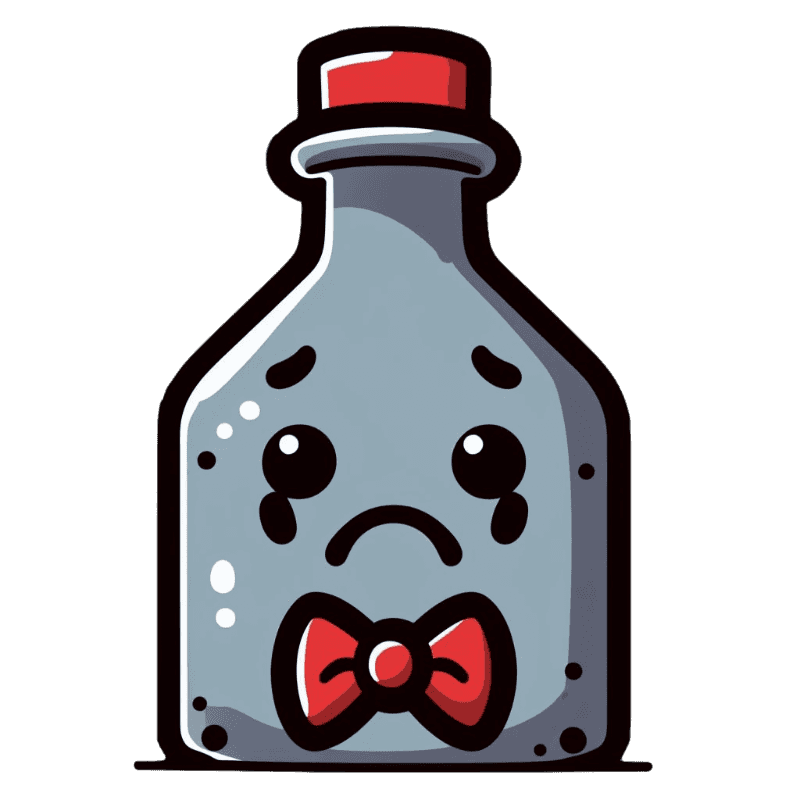

# Predictive Modeling for Student Alcohol Consumption

<p align="center">
  
</p>

## Project Overview

This repository contains the code and documentation for a data exploration and regression analysis project. The project aims to analyze a dataset, perform exploratory data analysis (EDA), and develop regression models to predict alcohol consumption variable based on various student attributes.

## Table of Contents

1. [Prerequisites](#prerequisites)
2. [Getting Started](#getting-started)
3. [Data Preparation](#data-preparation)
4. [Dummy Regressor](#dummy-regressor)
5. [Testing Models](#testing-models)
6. [Tested Models](#tested-models)
7. [Performance Metrics](#performance-metrics)
8. [Best Model](#best-model)
9. [Conclusions](#conclusions)

## Prerequisites

Before running the code, make sure you have the right dependencies installed.

## Getting Started

1. Clone the repository:

   ```bash
   git clone https://github.com/matlaczj/Predictive-Modeling-for-Student-Alcohol-Consumption
   cd Predictive-Modeling-for-Student-Alcohol-Consumption
   ```

2. Follow the steps outlined in the project documentation to replicate the analysis and results.

## Data Preparation

After initial preprocessing and exploratory analysis, the dataset was normalized, and the target variable was scaled to enhance model performance.

## Dummy Regressor

To establish a baseline, a dummy regressor was implemented. It employs simple strategies such as predicting the mean or median of the training data.

## Testing Models

Various regression models were tested and fine-tuned using cross-validation. Hyperparameters were chosen based on performance metrics, and the results were visualized to aid in the selection process.

## Tested Models

The following regression models were explored:

- Multiple Linear Regression
- Polynomial Regression
- Ridge Regression
- Lasso Regression
- ElasticNet
- SVM with Polynomial Kernel
- SVM with Linear Kernel
- SVM with RBF Kernel
- Decision Tree
- Least Angle Regression

## Performance Metrics

Performance was evaluated using Mean Absolute Percentage Error (MAPE), providing insight into the accuracy of predictions.

## Best Model

The model with the best performance was selected based on cross-validation results, learning curves, and efficiency.

## Conclusions

The project concludes with insights into the effectiveness of different regression models for predicting student alcohol consumption. Recommendations for further improvements or research directions are discussed.
